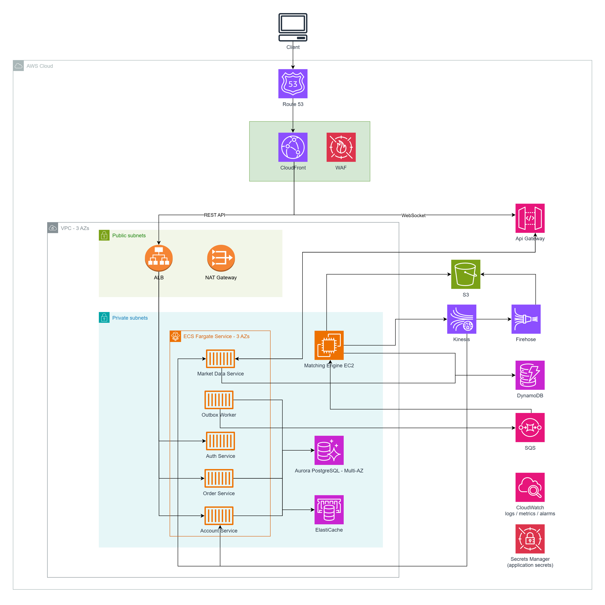

# Problem 2 — Trading System on AWS

## Scope

This is a simplified trading platform design on AWS. I focus on the parts that matter most for the challenge:

- order placement and matching
- account and balance updates
- real-time market data over WebSocket

Target: **500 RPS** and **p99 < 100ms** for the order acceptance API. The actual trade execution happens asynchronously after the order is accepted.

## Architecture

At a high level:

- Route 53, CloudFront, and WAF handle the public edge.
- ALB routes REST traffic to ECS Fargate services.
- API Gateway WebSocket handles real-time client connections.
- Aurora PostgreSQL is the source of truth for orders, balances, and accounts.
- Redis is used for short-lived cache such as sessions and balance pre-checks.
- SQS FIFO passes accepted orders to the matching engine.
- The matching engine runs on EC2 because it is stateful and latency-sensitive.
- Kinesis carries trade and market events to downstream consumers.
- S3 stores snapshots and audit/archive data.

## Main request flow

When a user places an order:

1. The request goes through Route 53, CloudFront, WAF, and ALB.
2. Order Service validates the request and does a fast Redis pre-check.
3. In one Aurora transaction, it locks the balance row, reserves funds/assets, inserts the order, and inserts an outbox row.
4. The API returns `202 Accepted` after the database transaction succeeds.
5. Outbox Worker reads unpublished rows from Aurora and publishes order commands to SQS FIFO.
6. Matching Engine consumes ordered messages from SQS and updates the in-memory order book.
7. Matching Engine publishes trade/engine events to Kinesis.
8. Account Service consumes trade events and updates balances in Aurora.
9. Market Data Service consumes the same stream and pushes fills / market data through API Gateway WebSocket.

The API does not wait for matching to finish. This keeps the request path short enough for the p99 target.

## Service choices

### CloudFront + WAF

Used for TLS termination at the edge, rate limiting, and basic protection against unwanted traffic. WAF rules block bad requests before they reach the VPC.

Alternative considered: putting WAF directly on ALB. Rejected because CloudFront absorbs traffic globally and reduces load on the origin, while ALB-only WAF still lets raw traffic hit the region.

### ALB + ECS Fargate

REST services are stateless, so ECS Fargate is a good fit. It scales tasks based on CPU or request count without managing EC2 instances.

Alternative considered: Lambda. Rejected for the order hot path because cold starts and execution variance make the p99 target harder to control. EKS was also considered, but it adds operational overhead that is not justified at 500 RPS.

### API Gateway WebSocket

Managed service for persistent WebSocket connections. Market Data Service stores connection IDs in DynamoDB and uses the API Gateway Management API to push updates back to clients.

Alternative considered: self-managed WebSocket server on ECS. Rejected because sticky sessions and connection state management add complexity. API Gateway handles this and scales automatically.

### Aurora PostgreSQL

Stores the financial source of truth: balances, orders, and trade records. Balance reservation uses `SELECT FOR UPDATE` inside a transaction to prevent double-spend.

Alternative considered: DynamoDB for all data. Rejected because financial records need JOIN queries, ACID multi-row transactions, and schema enforcement — all of which relational databases handle better.

### ElastiCache Redis

Used only as a cache, not as the source of truth. Stores sessions, balance pre-check values, and top-of-book snapshots for fast reads. Aurora is always the authoritative source.

Alternative considered: DAX (DynamoDB Accelerator). Rejected because the primary database is Aurora, not DynamoDB. Redis also supports more data structures and is more flexible for caching patterns.

### SQS FIFO

Carries order commands from Outbox Worker to Matching Engine. `MessageGroupId` is set per trading pair so orders within a pair are strictly ordered while different pairs process in parallel. High throughput mode is enabled from the start so the queue has enough headroom for the 500 RPS target and future growth.

Alternative considered: MSK (Managed Kafka). Rejected at this scale because SQS is simpler to operate and cheaper at 500 RPS. MSK becomes the right choice later when the system needs higher throughput, longer event retention, or more consumer flexibility.

### Matching Engine on EC2

The order book lives in memory and should process each trading pair in a controlled order. EC2 is used here to get more control over CPU, memory, runtime tuning, and process placement.

Alternative considered: ECS Fargate. It could work for a smaller system, but I keep the matching engine on EC2 because this is the latency-sensitive and stateful part of the platform.

### Kinesis + Firehose + S3

Kinesis distributes trade events to multiple consumers with independent read positions. Account Service and Market Data Service consume the same stream without interfering with each other. Firehose archives events to S3 for audit and historical analysis.

Alternative considered: SNS with multiple SQS queues. Viable for fan-out but adds more moving parts and requires the Matching Engine to know about all downstream consumers. Kinesis decouples producers from consumers more cleanly.

### DynamoDB

Used for three independent high-throughput lookup tables: WebSocket connection registry (connectionId per user), Matching Engine leader lock and heartbeat, and optional trade-history indexes.

Alternative considered: Redis for the connection registry. Rejected because Redis does not offer the same conditional-write guarantee across AZs that DynamoDB provides. The Matching Engine leader election depends on atomic conditional writes, which DynamoDB handles natively.

### CloudWatch + Secrets Manager

CloudWatch collects logs, metrics, and alarms across all services. Secrets Manager stores database credentials and API secrets, rotated automatically without redeploying services.

Alternative considered: self-hosted monitoring (Prometheus + Grafana). Valid option but adds infrastructure to manage. CloudWatch integrates natively with all AWS services and reduces operational overhead at this stage.

## High availability

The main workload runs across 3 AZs:

- ALB spans public subnets.
- ECS services run in private subnets across 3 AZs.
- Aurora is Multi-AZ.
- Redis should run with replicas across AZs.
- SQS, Kinesis, DynamoDB, S3, and API Gateway are AWS managed services.
- Matching Engine uses a primary/standby model with a DynamoDB lock.

For a single-AZ failure, traffic should continue through healthy ALB targets, ECS tasks in other AZs, and Aurora failover. Orders already accepted are not lost because they are stored in Aurora and passed through SQS.

## Network isolation

Only ALB and NAT Gateway are placed in public subnets. ECS tasks, EC2 Matching Engine, Aurora, and Redis stay in private subnets.

NAT Gateway is kept for outbound access from private workloads. In production, I would use one NAT Gateway per AZ or VPC endpoints for AWS services where possible to reduce NAT dependency and cost.

No inbound internet traffic goes directly to ECS, EC2, Aurora, or Redis.

## Scaling plan

At the initial 500 RPS target:

- scale ECS services horizontally
- scale ALB normally with traffic
- scale Aurora read capacity if read traffic grows
- scale Redis for cache-heavy reads
- increase Kinesis shards as event volume grows
- add Matching Engine instances per trading pair

If order volume grows, I would split hot trading pairs into separate SQS FIFO queues or move to MSK/Kafka with partitions by symbol.

At much larger scale, the biggest changes would be:

- one matching-engine shard per major trading pair
- Kafka/MSK for higher event throughput
- account table partitioning/sharding by user ID
- separate read models for market data and trade history
- multi-region read replicas for global users

I would not run active-active matching across regions because order matching needs a single ordered source of truth per trading pair.

## Cost notes

The design tries to keep managed services for most components and uses EC2 only where control matters. Cost can be controlled by:

- keeping API services on Fargate autoscaling
- using EC2 only for Matching Engine
- storing audit/history data in S3
- using VPC endpoints to reduce NAT traffic
- scaling Kinesis shards and Redis only when needed
